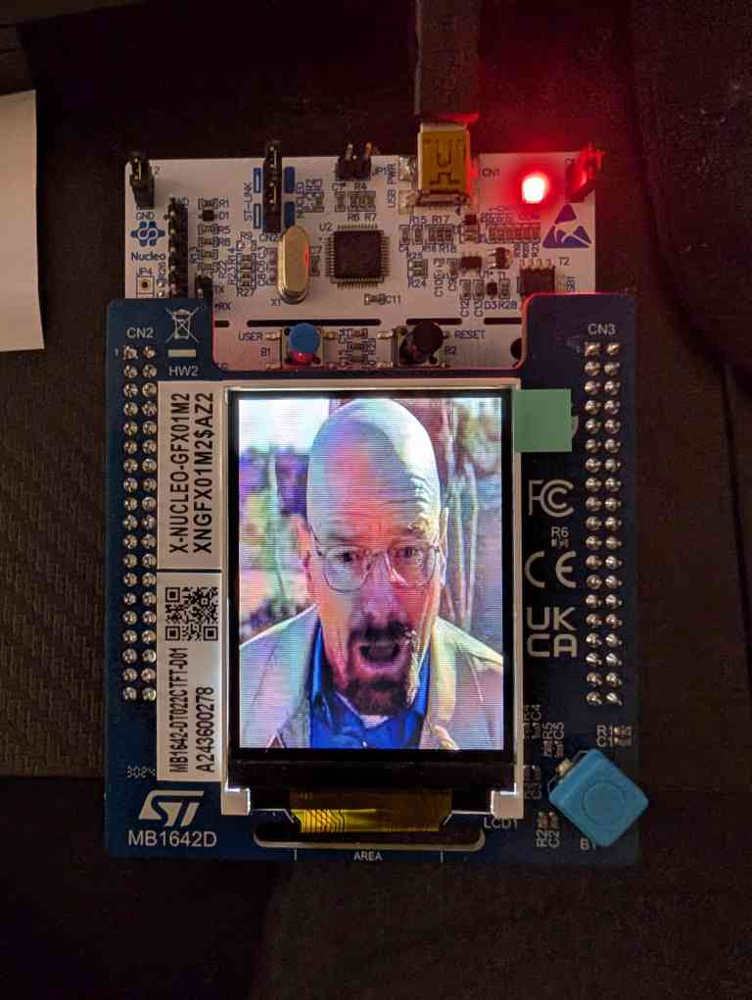

# Project Description

This project (**Project 3: SPI LCD Control**) drives a **240×320** color TFT over **SPI** on the **Nucleo-F091RC**. The display is the ST **GFX01M2** expansion (shield **MB1642-DT022CTFT**). Firmware is written with **direct register access** (GPIO, SPI1, no HAL display stack): initialize the panel, then stream **RGB565** pixels from flash.

The project requirements from the course were to flood the screen with red. I chose to extend the project to display a full-screen image of **Walter White** (*Breaking Bad*), generated offline from a PNG and stored as a C array in `Core/Inc/walter.h`.

# Implementation Details

## Hardware connections

From `Core/Inc/defines.h` and `Core/Src/main.c`:

| MCU pin | LCD signal | Notes |
|---------|------------|--------|
| PA1 | RST | Active low reset |
| PA5 | SCK | SPI1, alternate function AF0 |
| PA7 | MOSI | SPI1, AF0 |
| PA9 | CS | Chip select, active low |
| PB10 | DC | Data/command: 0 = command, 1 = pixel data |

Resolution: **240 × 320**, **16-bit** color (RGB565).

## Software architecture

All logic lives in `Core/Src/main.c` (comment at top: `lcd_display.c`):

1. **`init_lcd_gpio()`** — Enable GPIOA/B clocks; configure CS, RST, DC as outputs; SCK/MOSI as SPI1 alternate function.
2. **`init_spi()`** — Enable SPI1; master mode, software NSS, **SPI mode 0**, 8-bit frames initially, prescaler `f_PCLK/2`.
3. **`init_lcd()`** — Hardware reset pulse on RST; send controller commands:
   - **Sleep Out** (`0x11`)
   - **Pixel Format Set** (`0x3A`) → 16-bit (`0x55`)
   - **Memory Access Control** (`0x36`) → orientation `0x48`
4. **Framebuffer upload** — **Memory Write** (`0x2C`), DC high, CS low, switch SPI to **16-bit** data size, send `LCD_WIDTH * LCD_HEIGHT` halfwords.

Helper paths:

- **`lcd_send_command()`** — Single-byte command with DC low.
- **`lcd_send_command_with_args()`** — Command plus parameter bytes (DC toggles for data phase).
- **`spi_send8` / `spi_send16`** — Poll `TXE`, write `DR`, wait `BSY` when needed.

## Display modes (`WALTER_MODE` in `main.c`)

| `WALTER_MODE` | Behavior |
|---------------|----------|
| `0` | Solid **red** (`0xF800`) full screen, then display on — quick hardware/SPI check |
| `1` (default) | Blit `walter[]` from `walter.h` (240×320 RGB565), then display on |

## Image pipeline

1. Place a **240×320** PNG (or resize/crop to match the panel).
2. Run the converter:

```bash
python python/convert_img.py path/to/image.png Core/Inc/walter.h
```

3. The script (`python/convert_img.py`) uses **Pillow** to read RGB pixels and emit a `const uint16_t name[]` array in **RGB565** format (`((r & 0xF8) << 8) | ((g & 0xFC) << 3) | (b >> 3)`).
4. Include the header in `main.c` (`#include "walter.h"`) and loop over `walter[i]` when blitting.


# Demonstration

