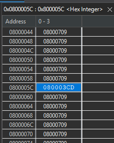
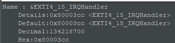

# Project Description
This project explores GPIO configuration, external interrupts, debouncing, and PWM signal generation. The assignment was to create a system that cycles through three different states using a debounced button press to trigger state changes via an external interrupt. Each state corresponds to a different LED behavior: on, off, and blinking. Finally, the project required me to inspect the interrupt vector table to verify my ISR was correctly mapped.
# Implementation Details
While not required, I wanted to challenge myself to write a program where the CPU does as little as possible. Thus, I decided to control the LED by passing its GPIO pin to a timer peripheral configured for PWM output. The button debounce is controlled by another timer peripheral configured to generate an interrupt after a short delay. The external interrupt on the button press starts the debounce timer, and when the debounce timer expires, it triggers another interrupt to handle the state change. This approach minimizes CPU usage, as all the CPU has to do is increment the state variable in the debounce timer ISR and update the PWM duty cycle in the main loop.

## Vector Table Inspection
In this microcontroller's architecture, the base address for the Interrupt Vector Table is `0x08000000`. In the included header file, the offset of the ISR for the button's GPIO pin is 7. However, the first 16 entries in the IVT are for core exceptions, so the true offset should be 16+7=23. Each entry in the IVT is 4 bytes long, so the ISR address can be found at `0x08000000 + ((16+7) * 4) = 0x0800005C`. 

In the debugger, I can stop the function at the beginning of the program and use the memory viewer to check the value at `0x0800005C`:

The IVT entry points to the address `0x800003CD`. To verify this is correct, I can find the value given by the expression `&EXTI4_15_IRQHandler`, which should give me the memory address of the ISR function I wrote.

The debugger gave me the value `0x800003CC`. This is weird because the address is off by one byte. However, this is explained by the fact that the least significant bit of a function pointer in ARM Cortex-M architecture indicates whether the function is using Thumb mode (which it always does). Therefore, the actual address pointed to byt the IVT is `0x800003CD & ~1 = 0x800003CC`, which matches the address given by the pointer expression. This confirms that my ISR is correctly mapped in the interrupt vector table.

# Demonstration Video
