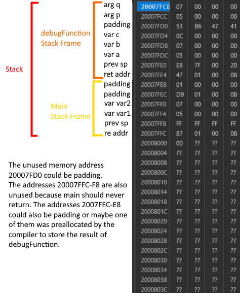

# Project Description
This project explores how variables local to a function are stored in stack frames during function calls. The goal is to set a breakpoint within a program and use the STM32 Cube IDE's memory viewer to inspect the stack and observe how local variables are represented in memory.

# Implemetation Details
First, I placed a breakpoint right before the return statement in the `debugFunction` within the following program:
```c
int debugFunction(int p, int q) {
    // Local copies of parameters
    int a = p;
    int b = q;
    // Simple operation on the locals
    int c = a + b;
    return c;  // breakpoint here (returning the sum)
}

int main(void) {
    int var1 = 5;
    int var2 = 7;
    // Call the debugFunction with two variables
    int result = debugFunction(var1, var2);
    // Infinite loop (program end)
    while (1) {
        // Do nothing, just loop
    }
}
```
I then hit debug. Once the breakpoint was hit, I looked at the SP register in the CPU registers window to find the current stack pointer address. I  then opened the memory viewer and navigated to that location in memory. I labeled the following screenshot to show my observations of how the variables were stored in the stack frame.
